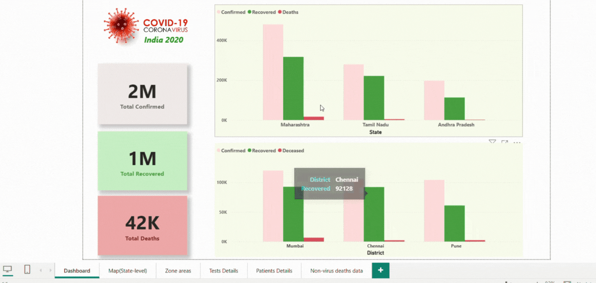

# COVID-19-India-Data-Visualization
"Visualization and analysis of India's COVID-19 data for 2020 using Python, Pandas, and Power BI."

# 📌 Project Overview
Comprehensive analysis and visualization of COVID-19 data for India in 2020. This project covers the entire data lifecycle: sourcing, cleaning, transformation with Python and Pandas, and building an interactive dashboard using Power BI and DAX for detailed state-wise and summary insights.

# 🔄 Project Workflow
COVID-19 data source ➡️ Data cleaning & transformation (Python, Pandas) ➡️ Export to CSV/Excel ➡️ Power BI dashboard reporting ➡️ Interactive KPI analysis

# 📊 Dataset
Columns: Confirmed Cases, Deceased, Active, Delta Confirmed, Tests per Positive Case, Positive Rate, State, Date, and more.

Source: Public COVID-19 datasets (India2020)

Format: CSV/Excel post-cleaning.

# 🔧 Steps Involved
-> Data cleaning and preparation using Pandas in Jupyter (removal of duplicates, type conversions, accuracy validation)

-> Exploratory data analysis to review key COVID-19 metrics and identify trends

-> Imported cleaned data into Power BI

-> Added calculated columns, created DAX measures for metrics like positivity rate

-> Built a six-page interactive Power BI report: slicers, KPIs, line charts, maps, and summary views

-> Implemented drill-down and filters for granular and interactive analysi

# 📈 Dashboard Pages
  1.Dashboard
  
  2.Map(State level)
  
  3.Zone areas analysis
  
  4.Tests analysis
  
  5.Patient analysis
  
  6.Non-Virus Deaths analysis

# 🚀 Tools & Technologies
Python (Pandas, Jupyter Notebooks)

Power BI

DAX

Excel/CSV

# 🧠 Learnings
-> How to clean and validate large real-world health datasets with Python

-> Best ways to visualize KPIs and trends for public health using Power BI dashboards

-> Using calculated columns and DAX for dynamic, real-time analysis in Power BI

-> Importance of interactive filters and drilldowns for user-driven exploration

# ✅ Page 1: Dashboard
Overview of the COVID-19 dashboard with summary statistics and key visuals.

# ✅ Page 2: State Analysis (Map)
Breakdown of cases, deaths, confirmed and recovered rate by Indian state.

.png)
